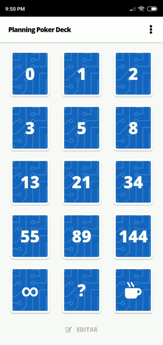

# Planning Poker Deck
> Simple offline first pwa for planning poker including most common decks: standard, fibonacci, t-shirt and risky.

[](https://planning-poker.victorheringer.com.br/)
[](https://github.com/VictorHeringer/planning-poker-deck/blob/master/LICENSE)
[](https://github.com/VictorHeringer/planning-poker-deck/issues)
[](https://github.com/VictorHeringer/planning-poker-deck)

## Why Planning Poker Deck



### 📴 Offline first. 

You don't need to rely on your mobile connection to estimate things!

### 💾 Small footprint. 

Less than 100kb gzipped and around 300kb unpacked!

### 🆓 No adds. 

Really, this app will never ever have ads.

### :octocat: Open Source. 

You know everything that is installed on your phone and always can send a pull resquest to fix or add a feature.

## Setup
This app uses create-react-app so all commands from it, is available here as well.
```
git clone https://github.com/VictorHeringer/planning-poker-deck.git
```
```
cd planning-poker-deck
```
```
npm install
```

This app has a story book, if you wanna check it out, just run:

```
npm run storybook
`

---
The dark mode is inspired by the awesome [dracula-theme](https://github.com/dracula/dracula-theme) color palette.

Planning poker deck is develop with :hearts: by [@victorheringer_](https://twitter.com/VictorHeringer_)
