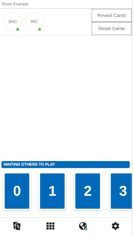

# Planning Poker Deck

> Simple offline first pwa for planning poker including most common decks: standard, fibonacci, t-shirt and risky and a multiplayer mode to play through internet.


[](https://planning-poker.victorheringer.com.br/)
[](https://github.com/VictorHeringer/planning-poker-deck/blob/master/LICENSE)
[](https://github.com/VictorHeringer/planning-poker-deck/issues)
[](https://github.com/VictorHeringer/planning-poker-deck)

|               Online                |               Themes               |               Offline                |
| :---------------------------------: | :--------------------------------: | :----------------------------------: |
|  |  |  |

## Why Planning Poker Deck

#### :boy: :girl: Multiplayer

Real time rooms for multiplayer matches from anywhere!

#### 📴 Offline first

You don't need to rely on your mobile connection to estimate things at
presencial matches.

#### 🎨 Different themes

Including two lights and one dark theme inspired by awesome [dracula-theme](https://github.com/dracula/dracula-theme) color palette.

#### 🆓 No adds

Really, this app will never ever have ads.

#### :octocat: Open Source.

You know everything that is installed on your phone and always can send a pull request for fixing or add a feature.

## Setup

This app uses create-react-app so all commands from it are available here as well. If you want to setup the multiplayer
you must follow the steps to setup the api as well.

```
git clone https://github.com/VictorHeringer/planning-poker-deck.git
```

```
cd planning-poker-deck
```

```
cat .env-sample > .env
```

After this step, you must setup the correct values for your environment.

```
yarn install && yarn start
```

### Api

The api uses node and socket.io, so for both backend and frontend all you will need is node and yarn.

```
git clone https://github.com/victorheringer/planning-poker-deck-api.git
```

```
cd planning-poker-deck-api
```

```
cd yarn install && yarn start
```

---

### Google Lighthouse


